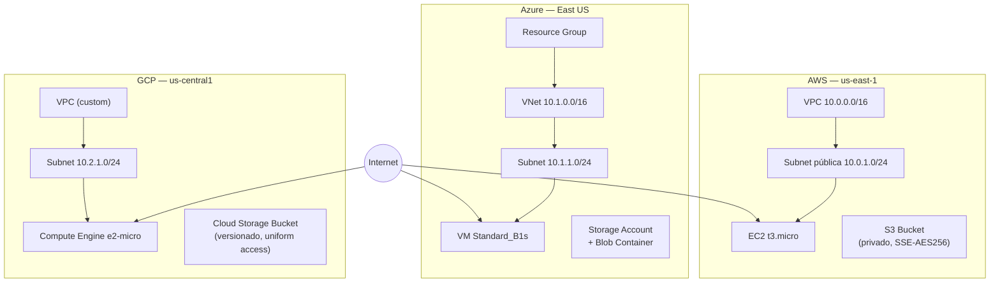

#Multi-Cloud Terraform IaC — AWS · Azure · GCP

-Infraestrutura como Código (IaC) modular para provisionar recursos básicos e comparáveis em **três provedores de nuvem simultaneamente**, 
-Usando Terraform 
-Estrutura de repositório padronizada.

Projeto criado como estudo prático de **Cloud Reliability Engineering** e como referência para comparação de custos, tempo de provisionamento e padrões de rede/computação/armazenamento entre AWS, Azure e Google Cloud.

---

##Objetivo

- Demonstrar provisionamento **multi-cloud** com o mesmo conjunto mínimo de recursos (rede, instância de computação, storage) em cada provedor.
- Servir como template reutilizável e didático para quem está aprendendo Terraform, DevOps e Cloud Reliability.
- Fornecer uma base comparativa de custo e tempo de deploy entre AWS, Azure e GCP.
- Aplicar boas práticas de IaC: modularização, variáveis, outputs, backend remoto, segredos fora do versionamento e pipeline de CI/CD.

---

##Pré-requisitos

| Ferramenta | Versão mínima | Observação |
|---|---|---|
| [Terraform](https://developer.hashicorp.com/terraform/downloads) | `>= 1.5` | CLI usada para provisionar todos os provedores |
| [AWS CLI](https://docs.aws.amazon.com/cli/) | v2 | Autenticação AWS |
| [Azure CLI](https://learn.microsoft.com/cli/azure/install-azure-cli) | mais recente | Autenticação Azure |
| [Google Cloud SDK](https://cloud.google.com/sdk/docs/install) (`gcloud`) | mais recente | Autenticação GCP |
| Contas ativas | — | Uma conta/assinatura/projeto em cada provedor, com permissões para criar VPC, VM/instância e storage |

Você não precisa provisionar os três provedores ao mesmo tempo — cada diretório (`aws/`, `azure/`, `gcp/`) é independente e pode ser executado isoladamente.

---

##Estrutura de diretórios

```
multicloud-terraform-iac/
├── aws/
│   ├── main.tf              # VPC, Subnet, Internet Gateway, EC2, S3
│   ├── variables.tf         # Variáveis customizáveis (região, tipo de instância, etc.)
│   ├── outputs.tf           # IP público da EC2 e nome do bucket S3
│   └── terraform.tfvars.example
├── azure/
│   ├── main.tf              # Resource Group, VNet, Subnet, NSG, VM, Storage Account
│   ├── variables.tf
│   ├── outputs.tf           # IP público da VM e nome da Storage Account
│   └── terraform.tfvars.example
├── gcp/
│   ├── main.tf              # VPC, Subnet, Firewall, Compute Engine, Cloud Storage
│   ├── variables.tf
│   ├── outputs.tf           # IP público da instância e nome do bucket
│   └── terraform.tfvars.example
├── .github/
│   └── workflows/
│       └── terraform.yml    # Pipeline CI/CD opcional (fmt, validate, plan, apply)
├── .gitignore
└── README.md
```

---

##Diagrama de arquitetura

Cada provedor segue o mesmo padrão: **rede isolada → instância de computação exposta publicamente → bucket de storage privado**.



---

## Processo de execução

### 1. Clonar o repositório

```bash
git clone https://github.com/<seu-usuario>/multicloud-infrastructure-terraform.git
cd multicloud-infrastructure-terraform
```

### 2. Configurar credenciais de cada provedor

```bash
# AWS
aws configure
# Informe: AWS Access Key ID, Secret Access Key, região padrão (ex.: us-east-1)

# Azure
az login
# Abre o navegador para autenticação; em seguida:
az account set --subscription "<subscription-id>"

# Google Cloud
gcloud auth login
gcloud auth application-default login
gcloud config set project <project-id>
```

### 3. Escolher o provedor e preparar as variáveis

```bash
cd aws        # ou azure / gcp
cp terraform.tfvars.example terraform.tfvars
# Edite terraform.tfvars com seus valores (nome da instância, região, tamanho etc.)
```

No caso do Azure, defina `ssh_public_key` com sua chave pública real (ex.: `cat ~/.ssh/id_rsa.pub`). Nunca versione essa chave — o `.gitignore` já ignora `*.tfvars`.

### 4. Inicializar o Terraform

```bash
terraform init
```

### 5. Validar o plano de execução

```bash
terraform plan -var-file="terraform.tfvars"
```

### 6. Aplicar as mudanças

```bash
terraform apply -var-file="terraform.tfvars"
```

Digite `yes` quando solicitado para confirmar o provisionamento.

### 7. Destruir os recursos (evitar custos desnecessários)

```bash
terraform destroy -var-file="terraform.tfvars"
```

---

##Exemplos de saída (outputs)

Após `terraform apply`, cada provedor exibe outputs semelhantes a:

**AWS**
```
instance_public_ip = "54.210.128.44"
instance_id        = "i-0a1b2c3d4e5f67890"
vpc_id              = "vpc-0abcd1234efgh5678"
s3_bucket_name      = "cloud-reliability-9f3a2b1c"
s3_bucket_arn        = "arn:aws:s3:::cloud-reliability-9f3a2b1c"
```

**Azure**
```
vm_public_ip           = "20.185.44.120"
vm_id                    = "/subscriptions/.../virtualMachines/cloud-reliability-vm"
resource_group_name    = "cloud-reliability-rg"
storage_account_name   = "clrel9f3a2b1c"
storage_container_name = "cloud-reliability-container"
```

**GCP**
```
instance_public_ip   = "34.68.201.15"
instance_id           = "1234567890123456789"
vpc_network_name      = "cloud-reliability-vm-vpc"
storage_bucket_name   = "cloud-reliability-9f3a2b1c"
storage_bucket_url    = "gs://cloud-reliability-9f3a2b1c"
```

---

##Boas práticas de segurança adotadas

- **Segredos fora do controle de versão**: arquivos `*.tfvars` reais são ignorados pelo `.gitignore`; apenas `*.tfvars.example` (sem valores sensíveis) é versionado.
- **Variáveis sensíveis marcadas** (`sensitive = true`), como `ssh_public_key` no Azure, para evitar exposição em logs de `plan`/`apply`.
- **Backend remoto recomendado**: cada `main.tf` traz um bloco `backend` comentado (S3+DynamoDB para AWS, Storage Account para Azure, GCS para GCP) para habilitar *state locking* e colaboração em equipe — evite manter o state local em produção.
- **Storage privado por padrão**: bucket S3 com *public access block* e criptografia SSE-AES256; bucket GCS com *uniform bucket-level access* e versionamento; container Blob do Azure criado como `private`.
- **Restrição de rede configurável**: variáveis como `ssh_ingress_cidr` (AWS) e `ssh_source_ranges` (GCP) permitem restringir o acesso SSH a IPs conhecidos em vez de `0.0.0.0/0` (padrão apenas para fins didáticos).
- **Uso de `TF_VAR_*` / variáveis de ambiente**: recomenda-se exportar segredos via variáveis de ambiente (`export TF_VAR_ssh_public_key="..."`) em pipelines de CI/CD, em vez de arquivos em disco.
- **Nomes únicos gerados automaticamente**: `random_id` evita colisão de nomes globalmente únicos (buckets S3/GCS, Storage Account) sem exigir input manual.

---

##Extras (destaques para publicação)

###Comparação de custos estimados (uso básico, ~730h/mês)

| Recurso | AWS | Azure | GCP |
|---|---|---|---|
| Computação (menor tier) | t3.micro (~US$ 7,50/mês) | Standard_B1s (~US$ 7,60/mês) | e2-micro (~US$ 6,10/mês, elegível ao free tier) |
| Storage (10 GB, standard) | S3 Standard (~US$ 0,23/mês) | Blob Hot LRS (~US$ 0,18/mês) | Cloud Storage Standard (~US$ 0,20/mês) |
| Rede/IP público | Incluso (IP dinâmico) | ~US$ 3,65/mês (IP estático Standard SKU) | Incluso (IP efêmero) |
| **Total aproximado** | **~US$ 7,73/mês** | **~US$ 11,43/mês** | **~US$ 6,30/mês** |

Valores ilustrativos e sujeitos a mudança conforme região, promoções e free tier vigente. Consulte as calculadoras oficiais ([AWS](https://calculator.aws/), [Azure](https://azure.microsoft.com/pricing/calculator/), [GCP](https://cloud.google.com/products/calculator)) para valores atualizados.

### ⏱️ Benchmark de tempo de provisionamento (referência)

| Provedor | `terraform init` | `terraform apply` (rede + VM + storage) | `terraform destroy` |
|---|---|---|---|
| AWS | ~5s | ~55–75s | ~40–60s |
| Azure | ~6s | ~120–180s | ~90–150s |
| GCP | ~5s | ~40–60s | ~30–45s |

> Tempos variam conforme região, carga da conta e latência de rede. Recomenda-se medir com `time terraform apply` no seu próprio ambiente para benchmarks reais.

###Pipeline CI/CD (opcional)

O workflow em [`.github/workflows/terraform.yml`](.github/workflows/terraform.yml) executa, em matriz para os três provedores:

1. `terraform fmt -check`
2. `terraform init`
3. `terraform validate`
4. `terraform plan` (em toda PR e push)
5. `terraform apply` (opcional, apenas via `workflow_dispatch` manual com confirmação)

Configure os *secrets* do repositório antes de habilitar o apply automático:
`AWS_ACCESS_KEY_ID`, `AWS_SECRET_ACCESS_KEY`, `ARM_CLIENT_ID`, `ARM_CLIENT_SECRET`, `ARM_SUBSCRIPTION_ID`, `ARM_TENANT_ID`, `GOOGLE_CREDENTIALS`.

###Demonstração em vídeo

> Espaço reservado para o link do vídeo de demonstração do provisionamento (ex.: gravação de tela do `terraform apply` em cada nuvem, seguido do `terraform destroy`). Recomenda-se um vídeo curto (2–4 min) ideal para acompanhar o post no LinkedIn.
>
> `[Adicione aqui o link do vídeo — YouTube/Loom/Drive]`

---

##Limpeza de recursos

Sempre execute `terraform destroy` ao final dos testes para evitar cobranças inesperadas nas três nuvens:

```bash
cd aws    && terraform destroy -var-file="terraform.tfvars" -auto-approve
cd ../azure && terraform destroy -var-file="terraform.tfvars" -auto-approve
cd ../gcp   && terraform destroy -var-file="terraform.tfvars" -auto-approve
```

---

## 📜 Licença

Projeto de uso livre para fins de estudo e portfólio. Adapte conforme a licença desejada (ex.: MIT) antes de publicar no GitHub.
